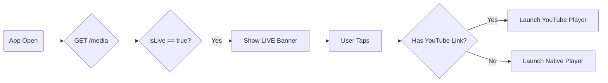

# � Mowdmin Mobile System Documentation

**Classification**: Technical Specification & Integration Guide
**Version**: 6.0 (Final Release)
**Target Audience**: Frontend Engineers (Mobile & Web), QA Testers
**Last Updated**: 2026-01-31

---

## � Registry of Contents

1.  **[System Overview](#1-system-overview)**
    *   Architecture Diagram
    *   Security Principles
2.  **[Integration Fundamentals](#2-integration-fundamentals)**
    *   Configuration
    *   Global Error Handling
    *   State Management Patterns
3.  **[Module Reference: User Application](#3-module-reference-user-app)**
    *   Authentication & Identity
    *   Media & Streaming (YouTube Live Config)
    *   Events & Registrations
    *   Commerce (Store & checkout)
    *   Community & Groups
    *   Spiritual Life (Prayer/Bible)
4.  **[Module Reference: Admin Dashboard](#4-module-reference-admin-dashboard)**
    *   User Governance
    *   Content Management System (CMS)
    *   Store Administration
5.  **[Data Dictionary (TypeScript)](#5-data-dictionary)**

---

## 1. System Overview

### 1.1 Architecture
The Mowdmin ecosystem consists of a secured REST API serving two distinct frontend clients: a public mobile application for members and a secured web dashboard for administrators.

```mermaid
graph TD
    Client[� Mobile App]
    Admin[� Admin Web]
    Gateway[�️ API Gateway /v1]
    
    Client -->|Bearer Token| Gateway
    Admin -->|Bearer Token (Admin)| Gateway
    
    subgraph Backend Services
    Gateway --> ServiceAuth[Auth Service]
    Gateway --> ServiceContent[Content Service]
    Gateway --> ServiceShop[Commerce Service]
    end
    
    ServiceContent -->|Config| YouTube[🔴 YouTube Live]
```

---

## 2. Integration Fundamentals

### 2.1 Configuration
*   **Production Base URL**: `https://api.mowdmin.com/api/v1` (Placeholder)
*   **Staging Base URL**: `https://mowdmin-mobile-be-qwo0.onrender.com/api/v1`
*   **Timeout Recommendation**: 15,000ms

### 2.2 Global Response Contract
All API responses strictly adhere to this envelope:
```json
// Success (HTTP 200/201)
{
  "message": "Operation successful",
  "data": { ... }, // Object or Array
  "statusCode": 200
}

// Error (HTTP 4xx/5xx)
{
  "status": "error",
  "message": "Human readable error message for UI toast",
  "errors": [ ... ] // Optional validation details
}
```

### 2.3 State Management Strategy
*   **Auth State**: Implement a Singleton or Global Store (e.g., Redux Slice `auth`).
    *   Persist: `token` (String), `user` (Object).
    *   Action: On `401 Unauthorized`, immediately dispatch `LOGOUT` and clear storage.
*   **Content State**: Use caching libraries (React Query/SWR) with a 5-minute stale time.
*   **Cart State**: Client-side persistence (LocalStorage/AsyncStorage). Sync with backend only at checkout.

---

## 3. Module Reference: User App

### 3.1 Authentication & Identity

#### **A. Login**
*   **Endpoint**: `POST /auth/login`
*   **Request**:
    ```json
    {
      "email": "user@example.com", 
      "password": "Password123!" 
    }
    ```
*   **Response**: Returns `token` (JWT). **Store this securely.**

#### **B. Register**
*   **Endpoint**: `POST /auth/register`
*   **Validation**:
    *   `name`: Min 2 chars.
    *   `password`: Min 6 chars, alphanumeric required.

#### **C. Social Auth (Google/Apple)**
*   Send the provider's token to the backend. The backend handles "Register if new, Login if exists".
*   **Google**: `POST /auth/google` `{ "idToken": "..." }`

---

### 3.2 Media & Streaming (📺 Core Feature)

### 3.1 List All Media
*   **Endpoint**: `GET /media`
*   **Query Params**: 
    *   `?page=1&limit=10` (Pagination)
    *   `?category=ID` (Filter by Category)
    *   `?isLive=true` (Filter for **Live Items Only**)
*   **Response Data**: `[ { "id": "uuid", "title": "...", "isLive": true, "youtubeLiveLink": "...", ... } ]`

#### **Fetching the Live Link (Directly)**
To get *only* the current live stream:
> `GET /media?isLive=true`
*   Returns an array. Take the first item: `response.data[0].youtubeLiveLink`.

#### **The "Live Now" Logic**
The Home Screen must intelligently display a banner when a service is live.

1.  **Filter**: Client-side check for `item.isLive === true`.
2.  **Visual Banner**: If found, show "🔴 Live Now: {item.title}".
3.  **Playback Logic**:
    *   If `isLive` is `true` **AND** `youtubeLiveLink` is present -> **Embed YouTube Player**.
    *   Otherwise -> **Use Native Video Player** with `media_url`.

**Visual Flowchart:**


---

### 3.3 Commerce & Store

#### **Checkout Sequence**
1.  **App**: User builds cart locally.
2.  **App**: User clicks "Checkout".
3.  **API**: `POST /orders/create`
    ```json
    {
      "items": [ { "productId": "uuid", "quantity": 1 } ],
      "totalAmount": 100
    }
    ```
4.  **API**: Returns `{ "id": "ORDER_123" }`.
5.  **App**: Calls `POST /payment/create`.
    ```json
    { "orderId": "ORDER_123", "amount": 100, "method": "card", "status": "success" }
    ```

---

## 4. Module Reference: Admin Dashboard

**Security Requirement**: All routes in this section fail with `403 Forbidden` if `user.isAdmin !== true`.

### 4.1 User Governance 👥
| Action | Endpoint | Method | UI Component |
| :--- | :--- | :--- | :--- |
| **View All** | `/auth/admin/users` | `GET` | Data Grid (Sortable) |
| **Promote** | `/auth/admin/users/:id/promote` | `PATCH` | Toggle Switch |
| **Editing** | `/auth/admin/users/:id` | `PUT` | Modal Form (Name/Phone only) |
| **Security** | `/auth/admin/users/:id/otp` | `POST` | Button: "Send Reset Email" |

### 4.2 Content Management (CMS) 📢

#### **Create Media Item**
*   **Endpoint**: `POST /media/create`
*   **Form Schema**:
    *   `title` (Text, Required)
    *   `type` (Select: Audio/Video)
    *   `thumbnail` (URL from File Upload)
    *   **Live Settings**:
        *   `isLive` (Checkbox)
        *   `youtubeLiveLink` (Text - Only enable if `isLive` is checked)

### 4.3 Order Operations 📦
*   **Cancel Order**: `POST /orders/:id/cancel`
    *   **Constraint**: Only available if order status is `pending` or `paid`.
    *   **UX**: Show a "Confirmation" modal before calling.

### 4.4 Moderation 🛡️
*   **Delete Group**: `DELETE /groups/:id/admin-delete`
    *   Use Case: Removing spam or inappropriate community groups.

---

## 5. Data Dictionary

**1. User Object**
```typescript
interface User {
  id: string;
  name: string;
  email: string;
  isAdmin: boolean;
  profilePicture?: string;
  createdAt: string;
}
```

**2. Media Object**
```typescript
interface Media {
  id: string;
  title: string;
  description?: string;
  thumbnail: string; // URL
  media_url?: string; // URL (S3/Cloudinary)
  type: 'audio' | 'video' | 'text';
  // Live Streaming Fields
  isLive: boolean;
  youtubeLiveLink?: string; // https://youtube.com/watch?v=...
}
```

**3. Notification Object**
```typescript
interface Notification {
  id: string;
  title: string;
  message: string;
  isRead: boolean;
  type: 'info' | 'alert' | 'transaction';
  createdAt: string;
}
```

---
*End of Documentation. For API support, contact the Backend Team.*
